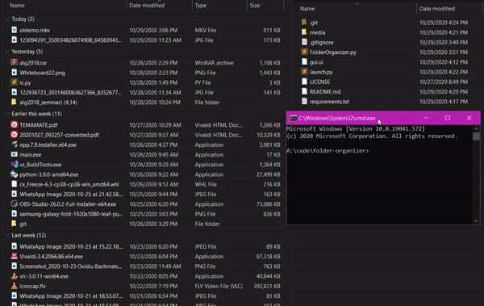

> ## Description
Folder-Organizer is a simple but quite useful script that organizes and sorts all  
files from a directory into subcategories folders.  
The project includes a simple GUI to select the directory you want to organize  
The script is built efficiently so in no time the folder will be organized.  
All the dependencies are included into the virtual environment.  
***
> ## How to use it ?
1. Open command prompt in the project directory 
2. Activate the virtual environment, so you won't need to download anything extra  
``` Scripts\activate.bat ```  
3. Run the script using python  
``` python launch.py```  
4. Select the directory path you want to organize  
5. Click 'Organize'
> ### Demo Usage on a 6GB folder
